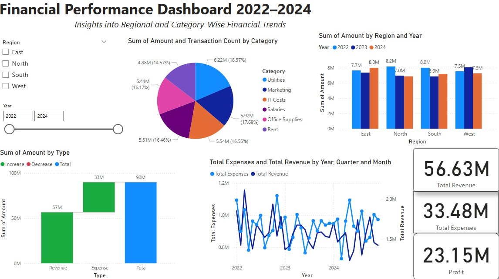

# 📊 Financial Dashboard - Power BI  

## 🚀 Overview  
This **Financial Dashboard** provides a comprehensive analysis of financial data, helping businesses track key financial metrics, revenue trends, and expense distributions. Built using **Power BI**, it offers interactive visuals to aid in financial decision-making.  

## 🖼️ Dashboard Preview  
  

## 📌 Features  
✅ **Key Financial Metrics** – Track Revenue, Expenses, Profit Margin, and Net Profit.  
✅ **Interactive Charts** – Visualize income & expenses over time.  
✅ **Expense Breakdown** – Identify major cost centers.  
✅ **Profitability Analysis** – Gain insights into financial health.  

## 📂 Files Included  
- **`Financial_Dashboard.pbix`** – Power BI dashboard file.  
- **`financialdashboard.jpg`** – Preview of the dashboard.  
- **`Sample_Data.xlsx`** – Dummy dataset used for analysis.  

## 📥 Download & Usage  
1️⃣ Clone the repository or download the `.pbix` file.  
2️⃣ Open the file in **Power BI Desktop**.  
3️⃣ Connect your own financial data (if needed).  
4️⃣ Explore interactive visuals and insights.  

## 🔗 Repository Link  
[GitHub Repository](https://github.com/saikiruthika-v/FinancialDashboard)  

## 👨‍💻 About the Author  
Created by **[Sai Kiruthika Lakshmi V]**, a Power BI enthusiast passionate about data analytics and financial insights.  

## 📢 Connect with Me  
🔗 [LinkedIn](https://linkedin.com/in/sai-kiruthika-v-046760204) 
---

Let me know if you want any modifications! 🚀
